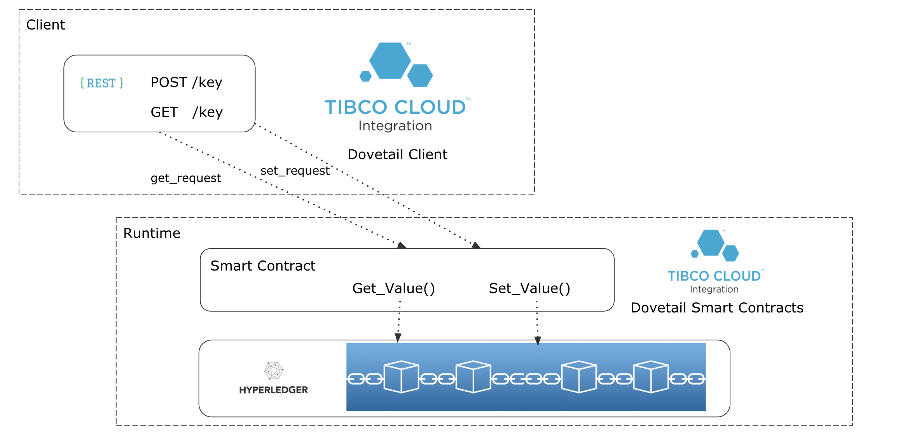

During this tutorial we will use Dovetail to create a hyperledger fabric Smart Contract and a client application that exposes the smart contract as a rest API all using Project Dovetail.

This is a very simple smart contract and rest API that mocks a key value store as defined in the following diagram

  </img>

